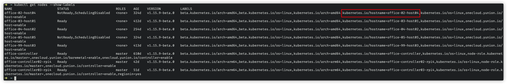
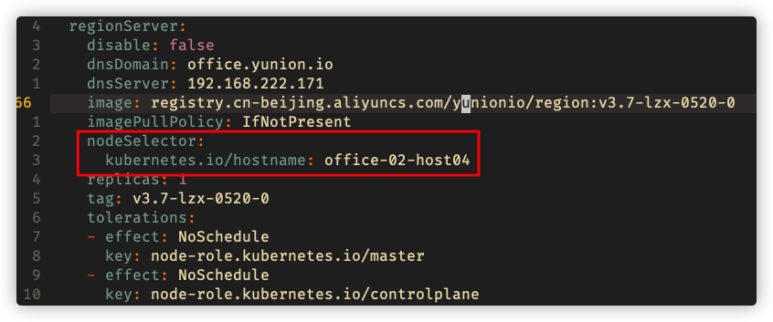

# 为服务指定 node

将某个服务调度到某个指定的节点上

## 查看节点的 label

```bash
# 查看节点的信息
kubectl get nodes --show-labels
```



如上图找到 key 为 kubernetes.io/hostname 的 label。

## 为服务添加 nodeSelector 

使用 `kubectl edit oc default` 打开 onecloudcluster 的配置，更改对应服务的配置，以 region 为例：



如图将上面选择的 label，增加到 nodeSelector 下。
