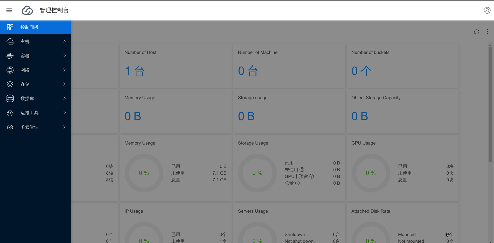
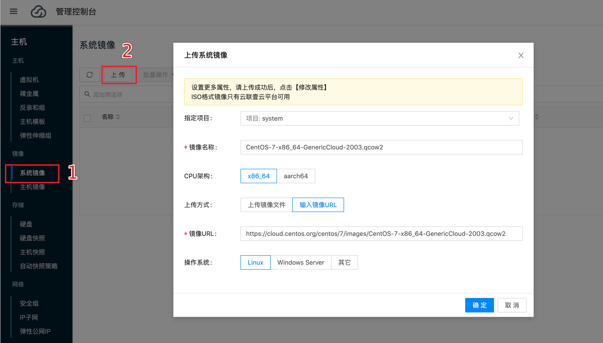
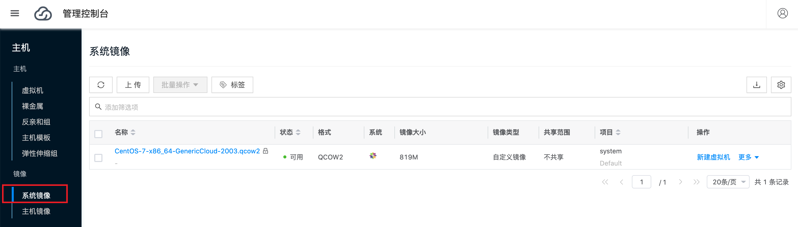
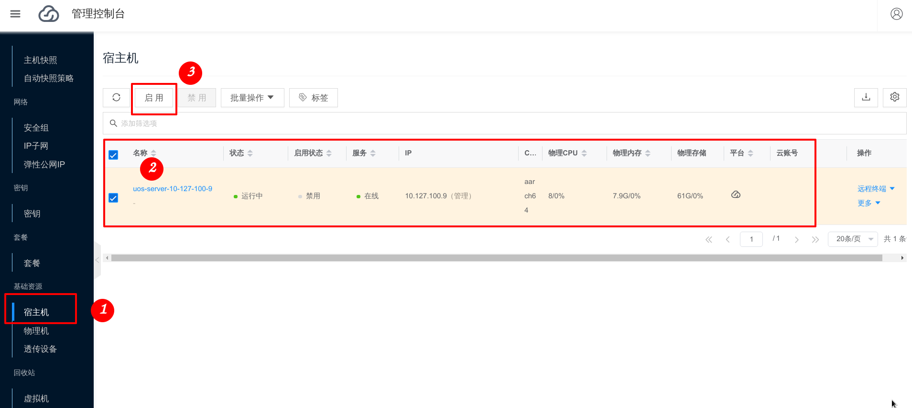
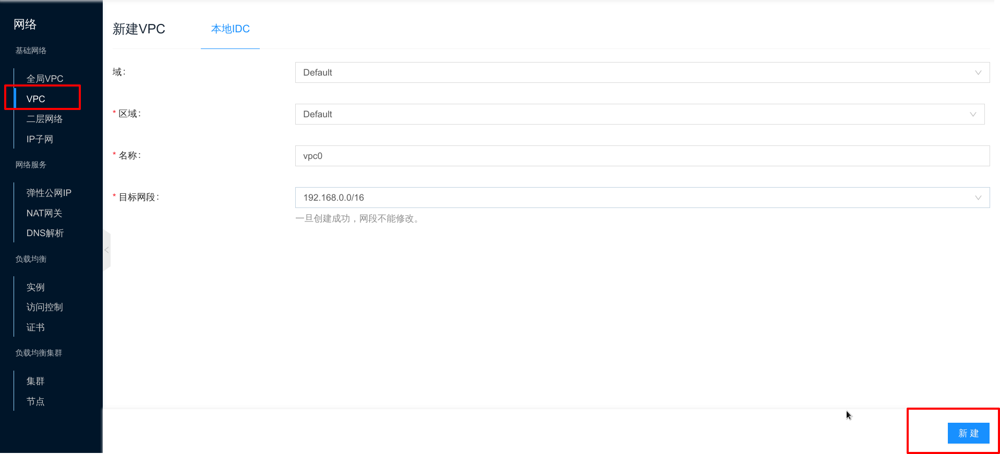
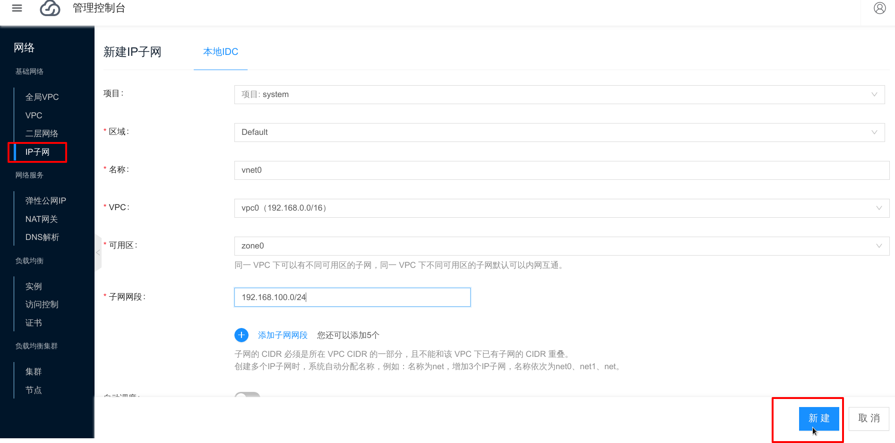
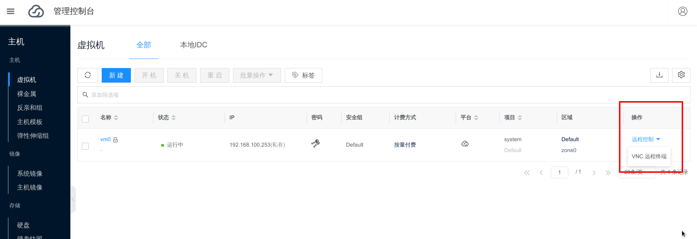
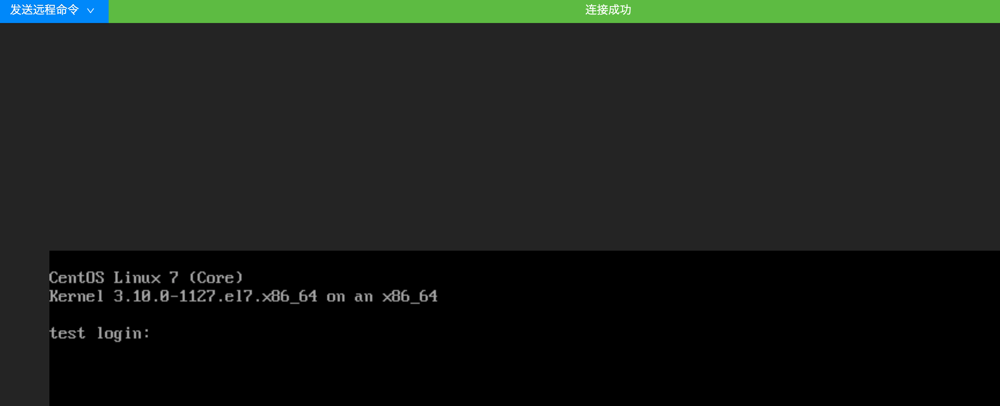

# 统信 UOS x86_64 部署 “云联壹云” 平台


提供一台 x86_64 的机器，使用 [统信 UOS](https://www.chinauos.com/) 官网下载的 ISO: uniontechos-server-20-enterprise-1030-amd64.iso 把系统安装好。然后就可以在这台机器上部署 “云联壹云” 平台。

以下是部署环境的必要条件：

- AMD 机器必须提前安装好 UOS 操作系统
- AMD 机器能够访问公网
- AMD 机器开启 SSH 服务，允许 root 用户登录，保证部署工具能够免密登录
- 最低配置要求: CPU 4核, 内存 8G, 存储 100G

## 部署

部署方式是使用我们编写的 [https://github.com/yunionio/ocboot](https://github.com/yunionio/ocboot) 部署工具来统一部署，这个工具里面包含了在 UOS 上部署的 ansible playbook 。

### 环境准备

首先使用 root 用户登录准备好的全新安装的 UOS 机器，查看 IP ，开启 SSH root 用户免密码登录，步骤如下：

1. 查看本机 IP

```bash
# 查看当前系统网卡的 IP ，发现是 10.127.100.9
# 这个 IP 后面编写部署配置文件会用到
# 请根据自己的环境把 IP 记录下来
$ ip addr
...
2: enp0s2: <BROADCAST,MULTICAST,UP,LOWER_UP> mtu 1500 qdisc pfifo_fast state UP group default qlen 1000
    link/ether 62:64:00:12:32:78 brd ff:ff:ff:ff:ff:ff
    inet 10.127.100.9/24 brd 10.127.100.255 scope global enp0s2
       valid_lft forever preferred_lft forever
    inet6 fe80::6064:ff:fe12:3278/64 scope link
       valid_lft forever preferred_lft forever
...
```

2. 开启 SSH root 用户登录

修改 `/etc/ssh/sshd_config` 配置文件，找到 PermitRootLogin 这个配置，改成 `PermitRootLogin yes`，修改后的截图如下：

```bash
$ vim /etc/ssh/sshd_config
```


3. 重启 SSH 服务

```bash
$ systemctl restart sshd
```

4. 开启 SSH 免密码登录

```bash
# 生成密钥对
$ ssh-keygen -b 2048 -t rsa -f /root/.ssh/id_rsa -q -N ""

# 放入授权文件
$ cat ~/.ssh/id_rsa.pub >> ~/.ssh/authorized_keys && chmod 600  ~/.ssh/*
```

以下为准备好的待部署机器的环境:

| IP   | 登录用户 |
|:----:|:--------:|
|10.127.100.9| root |

### 下载 ocboot 部署工具

```bash
# 更新源
$ apt update

# 下载必要的 git 和 ansible 工具
$ apt install -y git python-yaml python3-pip
$ pip3 install ansible

# 使用 git clone ocboot 部署工具
$ git clone https://github.com/yunionio/ocboot.git -b release/3.6

# 进入 ocboot 目录
$ cd ocboot
```

### 编写部署配置

```bash
# 设置 IP 环境变量，这个是当前环境的 IP ，请根据自己的环境进行设置
$ IP=10.127.100.9

# 设置 MYSQL_PSWD 变量
$ MYSQL_PSWD=your-sql-passwd

# 设置部署的云联壹云软件版本
$ TAG=v3.6.10

# 写入配置文件
$ cat > config-uos.yml <<EOF
# mariadb_node 表示需要部署 mariadb 服务的节点
mariadb_node:
  # 待部署节点 ip
  hostname: $IP
  # 待部署节点登录用户
  user: root
  # mariadb 的用户
  db_user: root
  # mariadb 用户密码
  db_password: "$MYSQL_PSWD"
# primary_master_node 表示运行 k8s 和 云联壹云 服务的节点
primary_master_node:
  hostname: $IP
  user: root
  # 数据库连接地址
  db_host: $IP
  # 数据库用户
  db_user: root
  # 数据库密码
  db_password: "$MYSQL_PSWD"
  # k8s 控制节点的 ip
  controlplane_host: $IP
  # k8s 控制节点的端口
  controlplane_port: "6443"
  # 云联壹云 登录用户
  onecloud_user: admin
  # 云联壹云 登录用户密码
  onecloud_user_password: admin@123
  # 该节点作为 云联壹云 私有云计算节点
  as_host: true
  onecloud_version: $TAG
EOF
```

### 开始部署安装

编写完配置文件后，就可以根据配置进行部署，操作如下：

```bash
# 该命令会自动安装部署 “云联壹云“ 平台
$ ./run.py config-uos.yml
```

上面的命令会拉取 docker 镜像，部署 kubernetes ，然后启动云平台相关的服务，根据网速的快慢，整个部署时间可能会运行 15-30 分钟左右。

等到上面的部署命令执行完成后，会看到以下的输出：

```bash
...
# 部署完成后会有如下输出，表示运行成功
# 浏览器打开 https://10.127.100.9
# 使用 admin/admin@123 用户密码登录就能访问前端界面
Initialized successfully!
Web page: https://10.127.100.9
User: admin
Password: admin@123
...
```

然后用浏览器访问 https://10.127.100.9 ，用户名输入 `admin`，密码输入 `admin@123` 就会进入“云联壹云” 的控制面板界面。



## 创建私有云虚拟机

通过以下步骤创建出第一台运行在 UOS x86_64 上的虚拟机：

### 导入镜像

对于 x86_64 虚拟机来说需要使用对应的 x86_64 虚拟机镜像，这里导入 x86_64 的 CentOS 7 虚拟机镜像进行测试。

这里使用的 x86_64 镜像为 [CentOS-7-x86_64-GenericCloud-2003.qcow2](https://cloud.centos.org/centos/7/images/CentOS-7-x86_64-GenericCloud-2003.qcow2)，下载地址为： https://cloud.centos.org/centos/7/images/CentOS-7-x86_64-GenericCloud-2003.qcow2 。

在 **主机** 菜单，选择 **系统镜像**，选择 **上传**。输入镜像名称，选择 **输入镜像URL**，CPU 架构选择 **x86_64**，上传方式选择输入镜像 URL，粘贴上述 CentOS 7 镜像URL，选择 **确定**。截图如下：



等镜像下载完并导入后的截图如下:



### 启用宿主机

然后去 **主机** 菜单，选择 **宿主机**，能看到当前平台注册进来的宿主机列表，宿主机作为运行虚拟机的基础资源，需要启用后才能创建虚拟机。

选择当前的宿主机，点击启用按钮，截图如下：



### 创建网络（VPC和IP子网）

1. 新建VPC

在 **网络** 菜单，选择 **VPC** 子菜单，选择 **新建**。输入名称，例如 **vpc0**，选择目标网段，例如 **191.168.0.0/16**。点击 **新建**。



2. 新建IP子网

VPC 创建完成后，选择 **IP子网** 子菜单，选择 **新建**。输入名称，例如 **vnet0**，选择VPC为刚才创建的VPC **vpc0**，选择可用区，输入 **子网网段**，例如 **192.168.100.0/24**。点击 **新建**。



### 创建虚拟机

镜像、宿主机和网络都配置好过后，刷新一次当前浏览器，就可以开始创建虚拟机了。

在 **主机** 菜单，选择 **虚拟机**，选择 **新建**。在此界面输入主机名，选择镜像和IP子网，创建虚拟机。截图如下：

输入虚拟机名称：


根据需要选择虚拟机配置和镜像，这里选择刚才导入的 CentOS-7-aarch64-GenericCloud-2003.qcow2 镜像，截图如下：


选择虚拟机网络，这里选择我们刚才创建的 vpc0 里面的 vnet0 子网，然后点击新建：


等待虚拟机创建好后，状态变为 **运行中**，可以点击 **密码** 获取登录信息，然后点击 **远程控制** 按钮里面的 **VNC 远程终端** 登录虚拟机。


点击 VNC 远程终端后，会进入虚拟机的控制台。





## 导入公有云或者其它私有云平台资源

云联壹云自身是一个完整的私有云，同时也可以统一纳管其他云平台的资源。

在 **多云管理** 菜单，选择 **云账号** 并新建，根据自己的需求填写对应云平台的认证信息，配置完云账号后 云联壹云 服务就会同步相应云平台的资源，同步完成后即可在前端查看。


